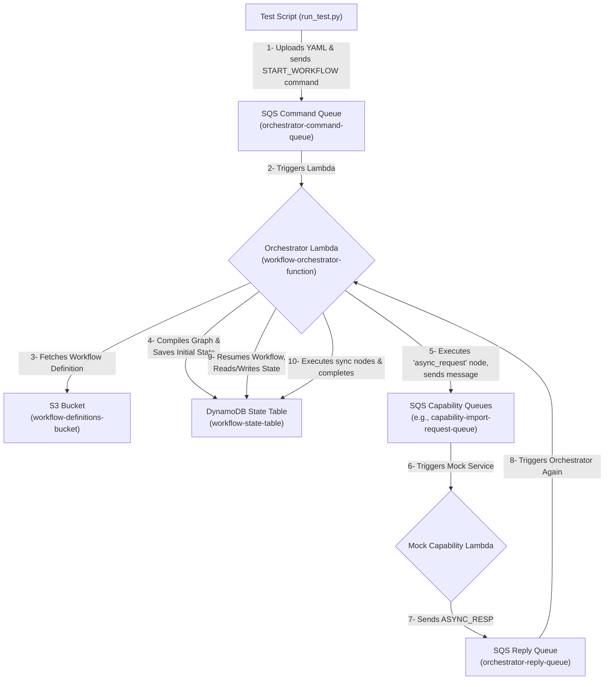

# CCH Workflow Orchestrator PoC

> **Part of the Customs Compliance Hub (CCH):**
> This Workflow Orchestrator Proof of Concept (PoC) is a core execution engine within Nike's Customs Compliance Hub (CCH)—the unified platform for automating and managing global trade compliance processes.

This repository contains the Proof of Concept for a serverless, event-driven workflow orchestrator built on AWS using Python and LangGraph.

## Resource Naming

All AWS resource names (queues, buckets, tables, etc.) are dynamically generated using the pattern:

    cch-<env>-<owner>-<resource-identifier>

where `<env>` and `<owner>` are set via CDK context (see deployment instructions). Example: `cch-dev-dvan97_nike-capability-import-request-queue`.


## Overview

The primary goal of this PoC was to build a system capable of executing complex, multi-step business workflows defined in simple YAML files. The orchestrator is designed to be stateless, scalable, and resilient, leveraging a combination of serverless technologies to manage long-running processes that involve both synchronous and asynchronous steps.

The system can:
- Ingest a workflow definition from a YAML file stored in S3.
- Start and execute a new instance of a workflow.
- Persist the state of the workflow to DynamoDB, allowing it to pause.
- Send requests to external "capability" services via SQS.
- Resume execution when a response is received from a capability.
- Handle multiple steps in sequence, based on the defined graph.

## Architecture

The orchestrator is built on a serverless, event-driven architecture using several core AWS services.



### Component Flow

1.  **Initiation**: A test script (`tests/scripts/run_test.py`) uploads a YAML workflow definition to an S3 bucket and sends a `START_WORKFLOW` command to an SQS queue.
2.  **Orchestrator Trigger**: The message on the SQS Command Queue triggers the main Orchestrator Lambda function.
3.  **Graph Compilation**: The Lambda fetches the YAML definition from S3, parses it, and uses LangGraph to compile it into an executable workflow graph. The initial state is saved to DynamoDB via the checkpointer.
4.  **Async Step**: The graph executes until it reaches an `async_request` node. The orchestrator sends a message to a dedicated SQS queue for that capability and the workflow pauses.
5.  **Mock Capability**: A mock Lambda service, listening to the capability queue, processes the request and sends a response message to the SQS Reply Queue.
6.  **Workflow Resume**: The response message triggers the Orchestrator Lambda again. The service uses the instance ID in the message to load the workflow's state from DynamoDB, re-compiles the graph in memory, and resumes execution from where it left off.
7.  **Sync Step & Completion**: The graph continues executing synchronous nodes, updating its state in DynamoDB after each step until it reaches the `end` node.

---

## Project Structure

```
.
├── workflow-orchestrator/
│   ├── src/                  # Orchestrator Lambda source code
│   ├── cdk/                  # AWS CDK infrastructure (TypeScript)
│   └── capability-mock-service/ # Mock Lambda for capability responses
├── workflow-definitions/     # Example workflow YAML definitions
├── schemas/                  # JSON schema files for workflow definitions and commands
├── sample-data/              # Sample ASN and delivery data for test runs
├── tests/                    # Test scripts
└── README.md
```

---

## Deployment

The entire stack is managed by the AWS CDK.

**Prerequisites:**
- Docker (required for CDK asset bundling and deployment)
- AWS credentials configured in your environment.
- Node.js and npm installed.
- Python 3.11 installed.
- AWS CDK installed (`npm install -g aws-cdk`).

**Deployment Steps:**
1. Navigate to the `cdk` directory:
   ```bash
   cd workflow-orchestrator/cdk
   ```
2. Install Node.js dependencies:
   ```bash
   npm install
   ```
3. **Set required environment variables for context:**
   The deployment requires you to set the environment variables `CCH_ENV` and `CCH_OWNER` so that the stack is uniquely named and tagged for your environment and user. For example:
   ```bash
   export CCH_ENV=dev
   export CCH_OWNER=userid-nike
   ```
4. Deploy the stack, passing the context values for owner and environment:
   ```bash
   cdk deploy --context owner=$CCH_OWNER --context env=$CCH_ENV
   ```
   Replace `userid-nike` and `dev` with your own values as needed.

**Destroying the Stack:**
To remove all created resources, run:
```bash
cdk destroy --force
```

## Troubleshooting

### Colima Issues with Docker Images

If you're experiencing problems with Colima failing to download Docker images, please refer to the Nike internal documentation: [Colima failed to download docker images](https://confluence.nike.com/display/APLANDE/Colima+failed+to+download+docker+images)

---

## Development Setup

### Python Virtual Environment

To set up a Python virtual environment for this project:

1. Navigate to the project root directory:
   ```bash
   cd nike-cch-workflow-orchestrator
   ```

2. Create a new virtual environment:
   ```bash
   python3 -m venv venv
   ```

3. Activate the virtual environment:
   ```bash
   # On macOS/Linux:
   source venv/bin/activate
   
   # On Windows:
   venv\Scripts\activate
   ```

4. Install dependencies:
   ```bash
   # For the main application:
   pip install -r workflow-orchestrator/src/requirements.txt
   
   # For testing:
   pip install -r tests/scripts/requirements.txt
   ```

5. When you're done working, you can deactivate the virtual environment:
   ```bash
   deactivate
   ```

---

## Testing

An end-to-end test script is provided to trigger and monitor a workflow instance.

**Before running the test:**
- Make sure you have set the following environment variables to match your CDK context:
  ```sh
  export CCH_ENV=dev
  export CCH_OWNER=userid
  ```
  The test script will construct resource names using these values (e.g., `cch-dev-userid-orchestrator-command-queue`).

**Sample Data:**
- The `sample-data/` directory contains sample ASN and delivery JSON files used for test runs.
- The test script uploads these files to the event data S3 bucket (`cch-<env>-<owner>-eventdata-bucket`) before starting the workflow, and their S3 URIs are used in the workflow context and capability responses.

**Schemas:**
- The `schemas/` directory contains JSON schema files for workflow definitions and command/response formats. These are used for validation and documentation of the workflow and integration contracts.

**To run the test:**
1. Make sure the stack has been deployed successfully.
2. From the project root, run the script with the desired definition file:
   ```bash
   python3 tests/scripts/run_test.py import_vn_memphis_v1.yaml
   ```
The script will upload the definition, start the workflow, upload sample data, and then monitor the CloudWatch logs for that specific workflow instance.

---

## Workflow Definition Structure

Workflows are defined in YAML files. Example:

```yaml
workflow_name: "Import VN to Memphis DC Enrichment (Async Test)"
workflow_id: "import_vn_memphis_v1"
entry_point: Prepare_Import_Enrichment
initial_context:
  - shipmentId
  - originCountry
  - destinationCountry
nodes:
  Prepare_Import_Enrichment:
    type: async_request
    title: "Request Import Enrichment"
    capability_id: "import#enrichment"
    request_output_keys: ["import_enrichment_uri"]
    on_response: Process_Import_Enrichment_Response
  Process_Import_Enrichment_Response:
    type: sync_call
    title: "Process Import Enrichment"
    capability_id: "core-process-response"
    output_keys: ["import_enrichment_uri"]
    on_success: End_Workflow
    on_failure: End_Workflow
  End_Workflow:
    type: end
    title: "End Workflow"
```

**Key fields:**
- `workflow_name`, `workflow_id`, `entry_point`, `initial_context`, `nodes`
- Node types: `async_request`, `sync_call`, `end`, etc.
- Node keys: `capability_id`, `request_output_keys`, `on_response`, `output_keys`, `on_success`, `on_failure`, etc.

---

## Key Design Decisions & Learnings

This PoC phase involved significant debugging and refactoring. The key challenges and solutions are documented here for future reference.

- **Dependency Conflict (`boto3` vs. `aioboto3`)**: The original `langgraph-checkpoint-amazon-dynamodb` library had a dependency on `aioboto3`, which conflicted with the newer `botocore` version required by `boto3`.
  - **Solution**: We forked the checkpointer library, removed the `aioboto3` dependency, and refactored its async methods to use standard `boto3` calls wrapped in `asyncio.to_thread`.

- **CDK Bundling with Local Packages**: The AWS CDK's `PythonFunction` construct had issues installing local, editable Python packages.
  - **Solution**: We "vendored" the refactored checkpointer library by copying its source code directly into the Lambda's source directory (`src/lib`) and adjusting the import paths accordingly.

- **Infrastructure vs. Application Mismatch**: The application failed with a `ValidationException` because the DynamoDB schema defined in the CDK (`thread_id`, `checkpoint_id`) did not match the schema expected by the LangGraph library (`PK`, `SK`).
  - **Solution**: The CDK stack was corrected to define the table with the `PK` and `SK` primary keys. This required a full `cdk destroy` and `cdk deploy` to apply.

- **Stateless Resume Logic**: Early versions of the resume logic failed because the compiled graph object was only stored in memory, causing errors on Lambda cold starts.
  - **Solution**: The `resume_workflow` method was made fully stateless. It now re-fetches the workflow definition from S3 and re-compiles the graph on every resume invocation, ensuring it can function correctly regardless of the Lambda instance's state.