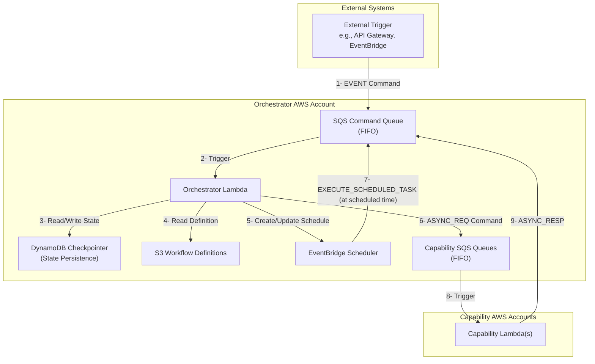

# CCH Workflow Orchestrator

This service is responsible for orchestrating complex workflows based on definitions written in YAML. It receives commands via an SQS queue, executes a series of steps defined in a state graph (using LangGraph), and interacts with various "capability" services (also via SQS) to perform specific tasks.

## Architecture

The orchestrator is built on a serverless architecture using AWS services:

-   **AWS Lambda**: The core compute service that runs the orchestration logic.
-   **Amazon SQS**: Used for receiving initial commands and for communicating with capability services.
-   **Amazon DynamoDB**: Provides state persistence for long-running workflows, leveraging the `langgraph-aws` library for checkpointing.
-   **Amazon S3**: Stores the YAML workflow definitions that the orchestrator uses to build the graphs.
-   **AWS IAM**: Provides the necessary permissions for the services to interact securely.
-   **Amazon EventBridge Scheduler**: Used to schedule delayed or recurring tasks within a workflow.




## Workflow Node Types

The orchestrator supports a rich set of node types to define complex workflows. Each node in the `nodes` section of a workflow definition must have one of the following `type` values.

### Core Execution & Flow Control

-   **`sync_call`**: Pauses the workflow to wait for a synchronous, external response, typically from a human-in-the-loop (HITL) action. The workflow is resumed by sending a `HITL_RESP` command.
-   **`async_request`**: Sends a command message to a capability's SQS queue and immediately pauses that execution path. The workflow is resumed when the capability sends an `ASYNC_RESP` command back.
-   **`scheduled_request`**: Creates a one-time schedule using Amazon EventBridge Scheduler. At the scheduled time, a command is sent back to the orchestrator, which then updates the state and sends a real `async_request` to a capability. This is used for delayed execution.
-   **`condition`**: Routes the workflow to different branches based on the value of a key in the workflow's data context.
-   **`end`**: Terminates the entire workflow instance.

### Parallelism & Synchronization

-   **`fork`**: Splits the workflow into multiple, concurrently executing branches, defined statically in the workflow definition.
-   **`join`**: Synchronizes multiple branches created by a `fork` or a `map_fork`. The workflow waits at the `join` node until all specified branches have terminated.
-   **`map_fork`**: A dynamic `fork`. It iterates over a list in the data context and creates a new parallel branch for each item in the list.
-   **`end_branch`**: Terminates a single branch of a parallel execution. This is used to signal completion to a corresponding `join` node.
-   **`event_wait`**: Pauses a specific branch until a designated `event_key` appears in that branch's data context. This is useful for waiting for multiple, different asynchronous updates within a single parallel flow.

### Utility Nodes

-   **`library_call`**: Executes a synchronous, pre-defined Python function directly within the orchestrator's Lambda. Used for simple, internal data manipulation tasks like parsing a file from S3 or calculating a date.
-   **`log_error`**: A dedicated error handling node. It logs a structured error message and then clears the workflow's internal error state, allowing for graceful recovery or termination.

## Deployment

The infrastructure is managed using the AWS Cloud Development Kit (CDK).

### Prerequisites

1.  AWS CLI installed and configured with valid credentials.
2.  Node.js and npm installed.
3.  AWS CDK installed (`npm install -g aws-cdk`).
4.  Python and `pip` installed for Lambda dependencies.

### Environment-Based Configuration

The CDK stack is designed to be deployed to multiple environments (e.g., `dev`, `prod`) from the same codebase. It uses environment variables at deployment time to configure resource names, tags, and the Lambda function's operational parameters.

**1. Standard Tags & Naming:**

The stack applies several standard NIKE tags and uses environment information for resource naming. These are read from environment variables during `cdk deploy`:

-   `ENVIRONMENT`: The deployment environment (e.g., `st`, `dev`, `qa`, `prod`). Defaults to `st`.
-   `CCH_OWNER`: The ID of the resource owner, used for naming dev resources (e.g., `jsmith`).
-   `NIKE_TAGGUID`: The Nike-specific tag GUID.

**2. Capability Configuration:**

The Orchestrator Lambda needs to know the SQS queue URLs of the various "capability" services it communicates with. Instead of hardcoding these or using config files, they are passed to the Lambda function as environment variables.

The CDK script automatically finds and passes any environment variable prefixed with `CCH_CAPABILITY_` to the Lambda function.

The naming convention is `CCH_CAPABILITY_<ID_OF_CAPABILITY_NODE>`. For example, if you have a node named `reverse_image_search` in your workflow definition, the Lambda will expect an environment variable named `CCH_CAPABILITY_REVERSE_IMAGE_SEARCH`.

There is also a special variable for a mock queue, which is used as a fallback if a specific capability queue is not defined:
-   `CCH_CAPABILITY_MOCK_QUEUE`

### Deployment Command Example

To deploy the stack for the `st` environment, you would navigate to the `workflow-orchestrator/cdk` directory and run a command like this:

```bash
# Set environment variables for tagging and configuration
export ENVIRONMENT="st"
export CCH_OWNER="jsmith"
export NIKE_TAGGUID="xyz-123"

# Set capability queue URLs
export CCH_CAPABILITY_REVERSE_IMAGE_SEARCH="https://sqs.us-east-1.amazonaws.com/123456789012/cch-capability-ris-dev-jsmith"
export CCH_CAPABILITY_IMAGE_METADATA="https://sqs.us-east-1.amazonaws.com/123456789012/cch-capability-im-dev-jsmith"
export CCH_CAPABILITY_MOCK_QUEUE="https://sqs.us-east-1.amazonaws.com/123456789012/cch-capability-mock-queue-dev-jsmith"

# Install CDK dependencies
npm install

# Deploy the stack
cdk deploy
```

This approach ensures that no secrets or environment-specific configurations are stored in the source code, adhering to security best practices and preparing the application for automated CI/CD pipelines.

## End-to-End Testing

The project includes a comprehensive end-to-end testing suite built with `pytest-bdd`. This suite deploys a complete, ephemeral instance of the orchestrator and its dependencies (including a mock capability service) to AWS for each test run.

### How It Works

1.  **Ephemeral AWS Environment**: The test runner uses the AWS CDK to deploy a new, isolated stack for the test session. This includes the orchestrator Lambda, SQS queues, DynamoDB tables, and a mock capability service.
2.  **Mock Service Control**: The mock service is a hybrid Lambda function. It listens for SQS messages from the orchestrator (simulating a real capability) and also exposes an HTTP API. The BDD tests use this API's control plane to configure how the mock service should respond to specific capability calls for each scenario.
3.  **BDD Scenarios**: Tests are defined in Gherkin (`.feature` files) located in `tests/features`. These business-readable scenarios drive the test execution.
4.  **Automatic Teardown**: After the test run is complete, the test framework automatically destroys the entire CDK stack, ensuring no resources are left running.

### Running the Tests

To run the entire test suite, follow these steps:

**1. Create the BDD Environment File**

The tests require a dedicated environment file to configure the CDK deployment. Create a file named `.env.bdd` inside the `workflow-orchestrator/cdk/` directory with the following content:

```bash
# Environment variables for BDD testing

# Sets the owner for resource naming to keep test resources separate.
CCH_OWNER=bdd

# Sets the deployment environment.
CDK_ENV=dev

# --- Standard Nike Tags for CDK ---
NIKE_OWNER="bdd.tester@nike.com"
NIKE_DL="some.dl@nike.com"
NIKE_ORG_L3="trade-customs-compliance-hub-test"

# This can be left empty for testing.
AUTHORIZED_COMMAND_QUEUE_SENDERS=""
```

**2. Execute the Test Command**

From the project's root directory (`cch-workflow-orchestrator`), run the following command. This command chains together all the necessary steps:

```bash
# 1. Install Python dependencies for the tests and the orchestrator
pip install -r tests/requirements.txt && \
pip install -r workflow-orchestrator/src/requirements.txt && \
\
# 2. Navigate to the CDK directory and install Node.js dependencies
cd workflow-orchestrator/cdk && \
npm install && \
\
# 3. Deploy the test stack using the BDD environment file
./cdk-with-env.sh -f .env.bdd deploy --all --require-approval never -c test=true && \
\
# 4. Navigate back to the project root and run pytest
cd ../../ && \
pytest tests/
```
This command will take several minutes to complete as it includes a full cloud deployment.
