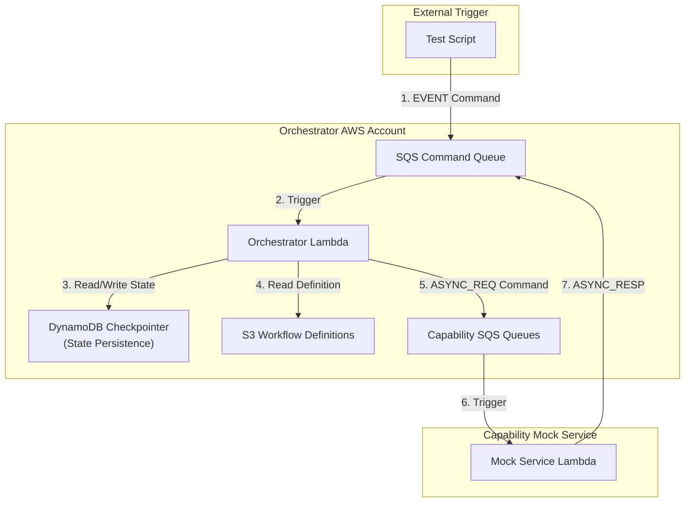

# CCH Workflow Orchestrator

This service is responsible for orchestrating complex workflows based on definitions written in YAML. It receives commands via an SQS queue, executes a series of steps defined in a state graph (using LangGraph), and interacts with various "capability" services (also via SQS) to perform specific tasks.

## Core Architecture

The orchestrator is built on a serverless architecture using AWS services:

-   **AWS Lambda**: The core compute service that runs the orchestration logic.
-   **Amazon SQS**: Used for receiving initial commands and for communicating with capability services.
-   **Amazon DynamoDB**: Provides state persistence for long-running workflows using `langgraph-aws` checkpointing.
-   **Amazon S3**: Stores the YAML workflow definitions.



## Workflow Node Types

The orchestrator currently supports the following node types, as demonstrated in the `import_us_v1.1.1-simplified-errorhandling.yaml` workflow.

-   **`async_request`**: Sends a command message to a capability's SQS queue and pauses the execution path. The workflow resumes when the capability sends an `ASYNC_RESP` command back.
-   **`condition`**: Routes the workflow to different branches based on the value of a key in the workflow's data context. This is used to check the `status` from a capability response.
-   **`event_wait`**: Pauses the workflow indefinitely, awaiting an external command to resume. This is used for Human-in-the-Loop (HITL) error handling.
-   **`set_state`**: Synchronously updates the workflow's state with a predefined set of static values.
-   **`log_error`**: A dedicated node for logging structured error messages.
-   **`end`**: Terminates the workflow instance.


## End-to-End Testing

The project includes an end-to-end testing suite built with `pytest`. This suite requires deploying a complete, ephemeral instance of the orchestrator and its dependencies (including a mock capability service) to an AWS account.

### How It Works

1.  **Ephemeral AWS Environment**: A developer uses the AWS CDK to deploy a new, isolated stack for the test session. This includes the orchestrator Lambda, SQS queues, DynamoDB tables, and a mock capability service.
2.  **Mock Service Control**: The mock capability service is a hybrid Lambda function. It listens for SQS messages from the orchestrator and exposes an HTTP API. The `pytest` tests use this API's control plane to configure how the mock service should respond for each specific test scenario.
3.  **Test Execution**: Tests are standard `pytest` files located in the `tests/` directory. They use helper classes to interact with the deployed AWS resources, send commands, and verify the final state of the workflow in DynamoDB.

### Running the Tests

To run the test suite, follow these steps:

**1. Configure your AWS credentials**

Ensure your local environment is configured with AWS credentials that have permissions to deploy the required resources.

**2. Navigate to the CDK Directory**

All CDK commands must be run from the `workflow-orchestrator/cdk` directory.
```bash
cd workflow-orchestrator/cdk
```

**3. Install CDK Dependencies**
```bash
npm install
```

**4. Deploy the Test Stack**

From the `workflow-orchestrator/cdk` directory, run the `cdk deploy` command. You must set a `CCH_OWNER` environment variable to create uniquely named resources for your testing.

```bash
# Set a unique owner name for your stack resources
export CCH_OWNER=yourname

# Deploy the CDK stack. The '-c test=true' flag deploys the mock service.
cdk deploy --all --require-approval never -c test=true
```
This process will take several minutes and will output the names and URLs of the created resources.

**5. Install Python Dependencies**

From the project's root directory (`cch-workflow-orchestrator`), install the required Python packages for the tests and the orchestrator itself.

```bash
# It is recommended to use a virtual environment
python -m venv .venv
source .venv/bin/activate

pip install -r tests/requirements.txt
pip install -r workflow-orchestrator/src/requirements.txt
```

**6. Run Pytest**

Once the stack is deployed and dependencies are installed, you can run the tests from the project's root directory.

```bash
# Run all tests
pytest

# Run a specific test file
pytest tests/test_hitl_error_handling_workflow.py

# Run a single test case
pytest tests/test_merged_simplified_workflow.py::test_merged_workflow_happy_path
```

**7. Destroy the Stack**

After you have finished testing, **it is critical to destroy the AWS resources** to avoid incurring costs. From the `workflow-orchestrator/cdk` directory, run:

```bash
# Use the same CCH_OWNER value you used for deployment
export CCH_OWNER=yourname

cdk destroy --all -c test=true
```
